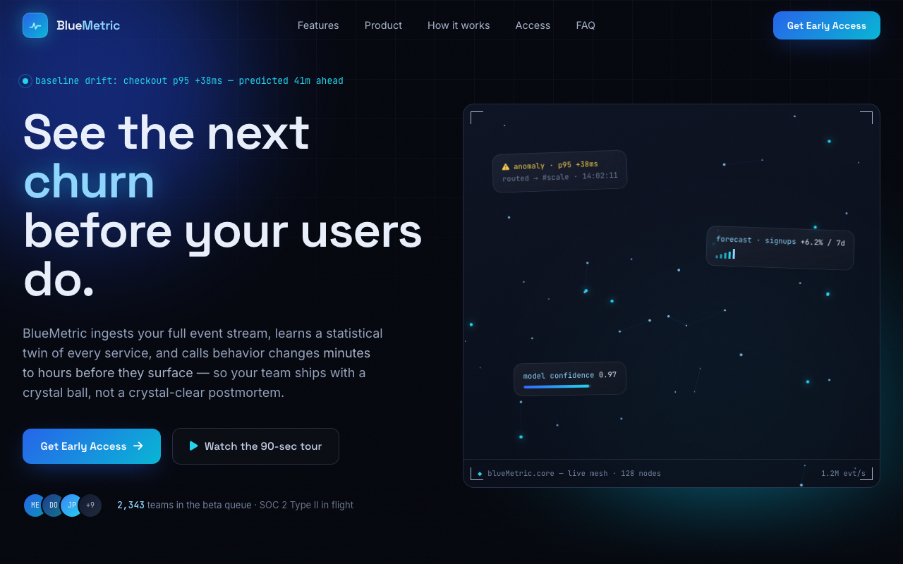
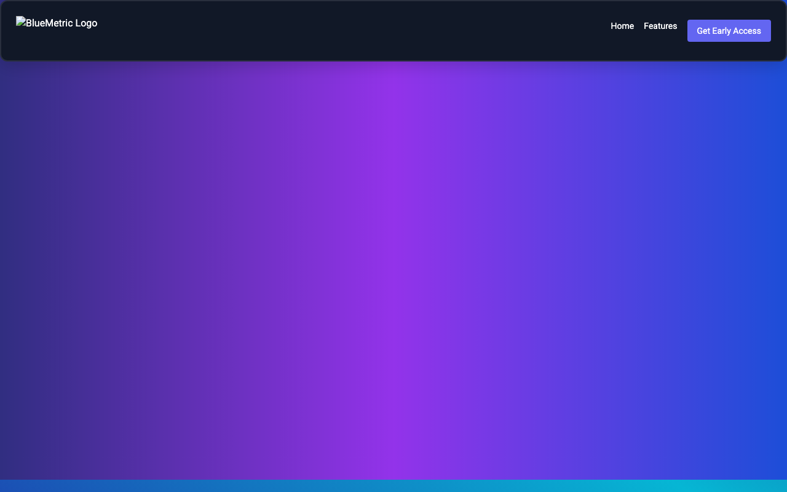

# Local AI Coding Tests

In order to test the abilities of the local models, I loaded each one into a fresh chat using LM Studio (to set up LM Studio, follow the instructions here: [Setup: LM Studio](../README.md#setup-lm-studio)).

I kept each prompt the same in order to have a consistent basis of comparison. The prompt can be found here: [prompt.txt](prompt.txt). It asks for a landing page for a made-up AI startup called "BlueMetric", in one single `index.html` file.

The four models I tried:

| Model | Download |
| --- | --- |
| Qwen 3.8 27B | [`lmstudio-community/Qwen3.8-27B-MLX-4bit`](https://huggingface.co/lmstudio-community/Qwen3.8-27B-MLX-4bit) |
| Gemma 4 26B A4B (QAT) | [`lmstudio-community/gemma-4-26B-A4B-it-QAT-MLX-4bit`](https://huggingface.co/lmstudio-community/gemma-4-26B-A4B-it-QAT-MLX-4bit) |
| Qwen3 Coder 30B A3B | [`lmstudio-community/Qwen3-Coder-30B-A3B-Instruct-MLX-4bit`](https://huggingface.co/lmstudio-community/Qwen3-Coder-30B-A3B-Instruct-MLX-4bit) |
| Qwen2.5 Coder 7B | [`mlx-community/Qwen2.5-Coder-7B-Instruct-4bit`](https://huggingface.co/mlx-community/Qwen2.5-Coder-7B-Instruct-4bit) |

All four are 4-bit MLX versions. Every run was one reply to the prompt, with no system prompt, in a new chat.

# How the models performed

## The numbers

These come from the stats LM Studio shows under each reply. Each model ran once, so treat them as a snapshot and not an average.

| Model | Size on disk | Context | Speed | Tokens written | First token | Total time |
| --- | --- | --- | --- | --- | --- | --- |
| Qwen 3.8 27B | 15 GB | 55,040 | 13.07 tok/s | 56,883 | 3.23 s | 72 min |
| Gemma 4 26B A4B | 15 GB | 104,192 | 64.96 tok/s | 5,440 | 0.59 s | 84 s |
| Qwen3 Coder 30B A3B | 16 GB | 8,192 | 68.25 tok/s | 3,295 | 0.57 s | 48 s |
| Qwen2.5 Coder 7B | 4 GB | 8,192 | 60.06 tok/s | 1,434 | 0.76 s | 24 s |

A few notes on these:

- I did not change the settings. LM Studio applied its own settings for each model. Gemma and Qwen 3.8 ran at temperature 1.0. The two Qwen Coder models did not set a temperature.
- The speed gap makes sense. Qwen 3.8 is a dense model. Every one of its 27B parameters works on every token. Gemma and Qwen3 Coder are MoE models. Only about 4B and 3B parameters are active at a time (that is the "A4B" and "A3B" in the names). So they are about five times faster. Qwen2.5 Coder is dense too, but at 7B it is small enough to be fast.
- Qwen 3.8 wrote more tokens (57,342 with the prompt) than its context size (55,040). LM Studio probably dropped the oldest text near the end. The page still came out complete.
- Qwen 3.8 spent about 32 minutes of its 72 minutes thinking. You can read its thinking in [`qwen3.8-27b/thinking.md`](qwen3.8-27b/thinking.md). Gemma's is in [`gemma-4-26b-a4b-qat/thinking.md`](gemma-4-26b-a4b-qat/thinking.md).

## Design

Because designing is very much subjective, my ranking might not match your own. I have attached a screenshot of each page so you can see for yourself. Every screenshot is the top of the page at 1280 × 800, taken after the intro animation finished.

### 1. Qwen 3.8 27B

This model took the longest to run, coming in at just over 72 minutes. I actually thought it was going to produce nonsense but I must say I was pleasantly surprised with the output. It was genuinely impressive for a one-file page.
All the nav links worked, the web page had a clean and consistent design and genuinely the only flaw I could find was a small glitch when the words switch in the hero section. Here is a clip of it:

https://github.com/user-attachments/assets/ce3f0a7f-e04c-4e8f-a18e-48df692909c3

Other than that this is by far the best local model I have ever run on coding tasks. I genuinely feel like a few months ago this is what you got from a paid subscription and now I get the same output from a model running locally on my laptop. I can only imagine what we'll be running a year from now.

### 2. Gemma 4 26B A4B

The Gemma model is by far the cleanest. It has a very minimal design and the website was very basic. To be fair this is more a reflection on how bad my prompting skills were, but in general this is very clean for a local model. I think I prefer this aesthetic over Qwen 3.8 simply because it doesn't add anything that isn't completely necessary. I am very sure that if I were to prompt better, I could get really good output from this model. Also, comparing the time, this model ran much quicker (84 seconds, against 72 minutes) for a pretty good final design. The only flaw on this page was a sizing issue during the opening animation. The text starts off shrunk and grows, but in doing so the lines split as the text gets bigger. Here is a clip of it:

https://github.com/user-attachments/assets/3c869d47-2b3c-47f4-b79f-8b720faaf58c

### 3. Qwen3 Coder 30B A3B

This model was pretty disappointing to be honest. The model needs about 16 GB of memory just to load, which is more than Qwen 3.8 needs (15 GB), and Qwen 3.8 was far more capable. The design was extremely basic and the background felt like an incomplete design. The navbar was extremely narrow in height and the buttons had a persistent glow, as if you were hovering over them. The hero section also has a headline that looks like the bottom of the text is cut off. I explain why that happens in the [code quality](#code-quality) section below.

### 4. Qwen2.5 Coder 7B

I do think this was unfair, pitting this against much larger models, but I also wanted to demonstrate what is possible on more constrained hardware. Unfortunately the result is unusable. The model produced broken HTML that didn't show anything, because the background was being drawn above the main content. Even when I fixed the dead logo and moved the background layer behind the content (see the [fix log](#fix-log) below), the resulting page looks like a high schooler who just started a YouTube tutorial but got bored halfway through. The navbar items are not aligned either: the links sit higher than the button. Harsh, yes, but it's true.

As generated (the hero is hidden behind the background):

With the fixes from the fix log:

## Code quality

That is how the pages look. Now for the code behind them. The prompt allowed the models to use Tailwind CSS, Google Fonts and Font Awesome from a CDN. All four models used all three, and all four wrote one self-contained `index.html`, as asked. That part worked every time.

To check the rest, I opened each page in Chrome and let the animations finish. I checked every nav link, read the console for errors, and checked the page at a phone width (390 px). Then I ticked off the list in the prompt.

| From the prompt | Qwen 3.8 | Gemma 4 | Qwen3 Coder | Qwen2.5 Coder |
| --- | --- | --- | --- | --- |
| One self-contained file | ✅ | ✅ | ✅ | ✅ |
| Sticky nav with working anchor links | ✅ 5 of 5 work | ⚠️ 1 of 3 work | ⚠️ 1 of 3 work | ✅ 2 of 2 work |
| Highlighted "Get Early Access" button | ✅ | ✅ | ✅ | ✅ |
| Hero with headline, text and two buttons | ✅ | ✅ | ✅ | ❌ covered by the background |
| Animated hero background | ✅ canvas mesh | ✅ canvas network | ✅ floating orbs | ⚠️ a gradient that moves 20 px |
| Features grid, 3 to 4 cards with icons | ✅ 4 cards | ✅ 3 cards | ✅ 4 cards | ✅ 3 cards |
| Footer with copyright and social links | ✅ | ✅ | ✅ | ✅ |
| Fade-in or slide-up animation | ✅ | ✅ | ✅ | ❌ none |
| Hover effects on buttons and cards | ✅ | ✅ | ✅ | ✅ |
| Fits a phone screen (390 px) | ⚠️ scrolls sideways | ✅ | ✅ | ✅ |
| Errors in the console | ⚠️ 1 error | ✅ none | ✅ none | ⚠️ dead logo link |

What went wrong, model by model:

- **Qwen 3.8** has the most code by far: 4,233 lines and 203 KB, against 348, 288 and 98 lines for the others. It has one real bug. The chart in the "console" mock-up never draws. The code calls `ctx.setLineDash` with a function instead of a list, so the browser throws an error and the chart area stays empty. On a phone-sized screen the page is 486 px wide, so it scrolls sideways.
- **Gemma 4** has "Technology" and "Pricing" links in the nav, but the page has no sections for them (`#about` and `#contact` do not exist). It also added an email sign-up form that the prompt did not ask for.
- **Qwen3 Coder** has "How It Works" and "Testimonials" links that point to sections that do not exist. The headline has `overflow: hidden` for its typing effect, and that is why the bottoms of the letters look cut off. The blinking bar next to the headline is the typing cursor. Every button has the `glow` class all the time, so they glow even when you do not hover.
- **Qwen2.5 Coder** drew the background as a layer on top of the page. The layer has no `relative` parent and no z-order, so it covered the whole hero. The logo points to `via.placeholder.com`, which no longer works. The page also loads Tailwind twice (version 2 as a stylesheet and version 3 as a script), and the hero card is not centered. The nav links sit higher than the button because the `<ul>` has no `items-center`.

### Fix log

I want this repo to stay honest, so here is every change I made to a model's output.

**Only one file was changed: `qwen2.5-coder-7b/index-fixed.html`.** It is a copy. The original `qwen2.5-coder-7b/index.html` is exactly what the model wrote. I made the copy so that you can see what the model was trying to build.

| Change | Why |
| --- | --- |
| Added `relative` to the hero `<section>` | The background layer now sizes itself to the hero and not to the whole screen. |
| Added `relative z-10` to the hero card | The card now sits above the background layer, so you can see and click it. |
| Changed the logo `src` from `via.placeholder.com/100` to `placehold.co/100` | The old image service is dead. The new one works the same way. |

I did not touch the style, the text, or the layout. The other three pages are untouched.

## Conclusion

In my very limited testing scope I found a few very good performers. Qwen 3.8 might need you to take a walk while it works but it is a very capable beast and I have no doubts that you could use it in a pinch when offline and see fairly decent results. Gemma 4 26B A4B is also very usable. The other two models are not usable in my opinion but could be used as an autocomplete perhaps? I will continue to expand testing and post any updates and findings.
