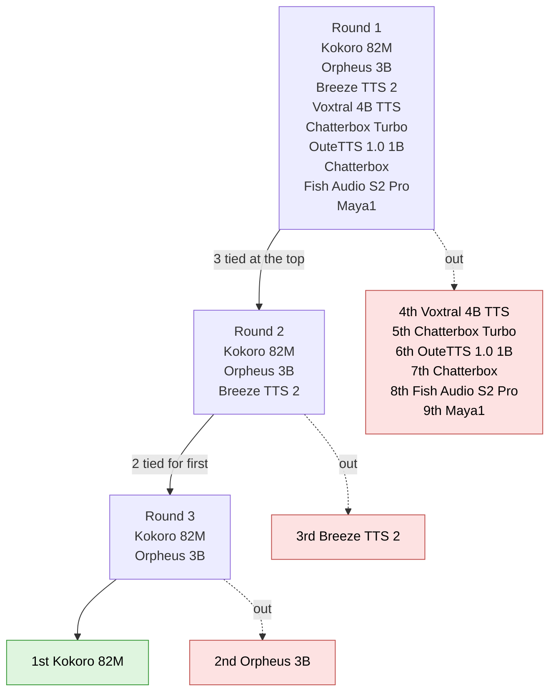

# Local AI Text-to-Speech (TTS) Tests

In order to test the text to audio generation abilities of the local models, I wrote a small python script that runs each model. Each model has it's own test script.

## Prerequisites

You need a Mac with Apple Silicon, because the models run on MLX. I used Python 3.14.

Set up the Python tools once. Run these commands from the `voice` folder:

```bash
python3 -m venv .venv
source .venv/bin/activate
pip install -r requirements.txt
```

The test scripts look for this environment at `voice/.venv`, so you don't have to activate it each time. To use a different Python, set the `PYTHON` variable, like this: `PYTHON=/path/to/python bash ./test.sh`.

Some models need packages that clash with the shared environment. Those models have their own `.venv` and `requirements.txt` inside their folder. Set one up the same way, but run the commands from the model's folder. Kokoro and Maya1 need this. I built the Kokoro environment with Python 3.13.

The first time you run a model, it downloads from Hugging Face. Some models are several GB. After that, it runs fully local, with no internet.

## How to run the script

If you want to run a model's test script, navigate to the folder and run `bash ./test.sh`.

> Hint: You might need to grant the script execution permissions on Mac. To do this, run the command `chmod +x test.sh`

You can also supply a `TEXT` parameter to test the model on custom text.
Example:

```bash
TEXT="This is a better sample text for the audio model to run against" ./test.sh
```

Some models also have additional parameters, you can look at the model's documentation to find out how to use them.

## Output format

Running the test script will produce a wav file that contains the text provided.

## The models

Every model said the same sentence (18 words, about four short sentences). I ran each one once. I ran everything (mostly) with the default voice of the model.

| Model                                             | Download                                                                                                          | Size   | Voice                       | Own `.venv` |
| ------------------------------------------------- | ----------------------------------------------------------------------------------------------------------------- | ------ | --------------------------- | ----------- |
| [Orpheus 3B](orpheus-3b/test.sh)                  | [`mlx-community/orpheus-3b-0.1-ft-bf16`](https://huggingface.co/mlx-community/orpheus-3b-0.1-ft-bf16)             | 6.2 GB | `tara`                      | no          |
| [Kokoro 82M](kokoro-82m/test.sh)                  | [`mlx-community/Kokoro-82M-bf16`](https://huggingface.co/mlx-community/Kokoro-82M-bf16)                           | 339 MB | `af_heart`                  | yes         |
| [Breeze TTS 2](breeze-tts-2-3b/README.md)         | [`mlx-community/Breeze-TTS-2-mlx`](https://huggingface.co/mlx-community/Breeze-TTS-2-mlx)                         | 7.1 GB | a text description          | no          |
| [Chatterbox](chatterbox/test.sh)                  | [`mlx-community/chatterbox-fp16`](https://huggingface.co/mlx-community/chatterbox-fp16)                           | 2.4 GB | the one in the model repo   | no          |
| [Chatterbox Turbo](chatterbox-turbo/test.sh)      | [`mlx-community/chatterbox-turbo-fp16`](https://huggingface.co/mlx-community/chatterbox-turbo-fp16)               | 2.8 GB | the one in the model repo   | no          |
| [Voxtral 4B TTS](voxtral-4b-tts/test.sh)          | [`mlx-community/Voxtral-4B-TTS-2603-mlx-bf16`](https://huggingface.co/mlx-community/Voxtral-4B-TTS-2603-mlx-bf16) | 7.5 GB | `neutral_female`            | no          |
| [OuteTTS 1.0 1B](outetts-1.0-1b/README.md)        | [`mlx-community/Llama-OuteTTS-1.0-1B-fp16`](https://huggingface.co/mlx-community/Llama-OuteTTS-1.0-1B-fp16)       | 2.3 GB | the one speaker that ships  | no          |
| [Fish Audio S2 Pro](fish-audio-s2-pro-5b/test.sh) | [`mlx-community/fish-audio-s2-pro-bf16`](https://huggingface.co/mlx-community/fish-audio-s2-pro-bf16)             | 10 GB  | the default (no voice flag) | no          |
| [Maya1](maya1-3b/README.md)                       | [`mlx-community/maya1-4bit`](https://huggingface.co/mlx-community/maya1-4bit)                                     | 1.8 GB | a text description          | yes         |

Maya1 needed a script of my own, `generate.py`, because `mlx_audio` builds the wrong prompt for it. Also, about a third of its takes end a little early (see below).

## The numbers

These are the lengths of the `.wav` files from one run each. I didn't time any of the runs, so there is no speed column. Plus it would vary depending on hardware.

| Model                     | Length of the sample |
| ------------------------- | -------------------- |
| Orpheus 3B                | 10.4 s               |
| OuteTTS 1.0 1B            | 10.4 s               |
| Voxtral 4B TTS            | 9.8 s                |
| Fish Audio S2 Pro         | 8.6 s                |
| Breeze TTS 2              | 8.3 s                |
| Kokoro 82M                | 8.2 s                |
| Chatterbox Turbo          | 7.2 s                |
| Chatterbox                | 7.1 s                |
| Maya1                     | 5.4 s                |

A longer clip is not a better clip. It only means the voice speaks more slowly, or pauses more. Listen to the samples in each `audio/tts/` folder and decide for yourself. You can open two folders side by side to compare.

## Quality ranking (blind test)

I wanted to rank the nine models by how good they sound, but my memory is bad. So I ran a blind test. The model names were hidden until I had ranked the clips. This is my own taste, so another person could rank them differently.

### How it worked

- I used a new text that I had not used before. I wrote down my notes on each clip while I listened.
- Each model ran with its own `test.sh` settings and its default voice. I only changed the text, the output name, and the token limit, which I raised to 8192 because the old limits were set for the short sentence.
- The clips had random names (`clip-A` to `clip-I`) and a random run order. The key was hidden until I finished ranking.
- One take per model, and no special features like laughing or whispering.
- Judged on quality only: how natural it sounds, the pauses, the pronunciation, and any glitches. Not on whether I like the voice.

### The result

| Rank | Model | What I heard |
| --- | --- | --- |
| 1 | [`Kokoro 82M`](kokoro-82m/test.sh) | Round 1: tied for first. Almost as good as the other two top clips, with no glitches and no robotic cut-offs. Round 2: expressive, like a professional voice actor, with every vowel and consonant deliberate. Round 3: it won, because the other clip had a slight echo. |
| 2 | [`Orpheus 3B`](orpheus-3b/test.sh) | Round 1: tied for first. Great pauses, like a real person, and no issues. Round 2: the most natural of the three, like a podcast, with an ASMR feel and a studio effect. Round 3: the slight echo got worse, and it lost. |
| 3 | [`Breeze TTS 2`](breeze-tts-2-3b/README.md) | Round 1: tied for first, and my favourite. Expressive, life-like and very human with numbers. About 95% human. Round 2: last of the three. Still good, but a little like a TikTok voice, and much louder than the others. |
| 4 | [`Voxtral 4B TTS`](voxtral-4b-tts/test.sh) | Less expressive than `Chatterbox Turbo`, but more natural, like a real person reading without much energy. That made it sound more real. It edged out `Chatterbox Turbo`, though the two had different styles. |
| 5 | [`Chatterbox Turbo`](chatterbox-turbo/test.sh) | Really good and expressive. About 85% human. Nothing to wow me, and no complaints. Next to `Voxtral 4B TTS` it sounded more generated. |
| 6 | [`OuteTTS 1.0 1B`](outetts-1.0-1b/README.md) | A British woman with a great voice, but the breaks were too long. Good for a speech, not natural. A few sighs, no glitches. |
| 7 | [`Chatterbox`](chatterbox/test.sh) | Nasal, like a man in his late twenties. One short glitch on the word "spring". About 75% human. It sounded like a voice-over telling a story, with no abrupt ending. |
| 8 | [`Fish Audio S2 Pro`](fish-audio-s2-pro-5b/test.sh) | Sounds like a posh old man. The pronunciation is good, but there is a slight off tone and it leans a little robotic. |
| 9 | [`Maya1`](maya1-3b/README.md) | A woman, but the pacing was bad, with no stops. Then it made up words. Instead of "stories about the trains their parents used to take" it said "sixty one toys explored and against house the fourteen answers in question", and kept going. |

### The elimination chamber

Three rounds, each with a new text. A round removed the clips that were clearly behind, and the ones I could not split went on to the next round.



#### Round 1: all nine models

> Text: "The old railway station had been closed for thirty years, but this spring the town turned it into a small museum. Volunteers spent three months cleaning the platforms and sorting boxes of letters that nobody had opened since the nineties. On opening day, four hundred people waited outside, and many of them brought stories about the trains their parents used to take."

- Too close to split: `Breeze TTS 2`, `Orpheus 3B`, `Kokoro 82M`. These three went through.
- Next: `Voxtral 4B TTS` (4th), then `Chatterbox Turbo` (5th).
- Out: `OuteTTS 1.0 1B` (6th), `Chatterbox` (7th), `Fish Audio S2 Pro` (8th) and `Maya1` (9th).

#### Round 2: the top three

> Text: "She carried the lantern down the narrow stairs, counting each step quietly, until the cold air told her she had reached the cellar."

- Out: `Breeze TTS 2`, last of the three.
- Through, tied for first: `Kokoro 82M` (more expressive) and `Orpheus 3B` (more natural).

#### Round 3: the final two

> Text: "It's all fun and games pitting MLX models against each other until voice expressivity isn't enough. Now the BlueMetric standard for TTS model evaluation balances the technical depth you can expect from someone who uses Clawd to write his NextJS code. Brad - this is the final chance to settle the great debate."

I wrote "Clawd" and not "Claude" because `Kokoro 82M` crashed on the word "Claude" (see the notes below). I kept the default voices and scaled both clips to the same loudness, because a louder clip often sounds better.

- Out: `Orpheus 3B`. It sounded great, but a slight echo got worse.
- Winner: **`Kokoro 82M`**.

### Notes and limits

- **Only round 3 had matched loudness.** In rounds 1 and 2 the clips were different in volume by several decibels. In round 2, `Breeze TTS 2` was much louder than the other two and still came last.
- **Each model has its own default voice,** so I could not make the voices the same. The two finalists were close in pitch.
- **One take each.** The same model can sound a little different each time. `Maya1` is the one most likely to be hit by this, because about a third of its takes end a little early.
- **`Kokoro 82M` crashed on one word.** In round 3, its text-to-phoneme step could not handle the word "Claude" and the run stopped with an error. I wrote "Clawd" for both models in that round so the text stayed the same. It still won, so I did not remove it. But it is a real weakness for text with names and brands.
- The clips themselves are not in the repo. They are easy to make again with each model's `test.sh`.

## What went wrong, model by model

Most of the work was not the AI. It was the setup. Most models needed their own fix before they would run. Orpheus and Fish are not in this table, because I have nothing special to report for them (which is good).

| Model                        | Problem                                                                                                                                                                                                      | Fix                                                                                    |
| ---------------------------- | ------------------------------------------------------------------------------------------------------------------------------------------------------------------------------------------------------------ | -------------------------------------------------------------------------------------- |
| Kokoro                       | `mlx_audio` says "install misaki", but the real error was a missing package (`num2words`). A plain install of `misaki[en]` then pulled a spaCy 4 development version which was not supported in my workflow. | The Kokoro `.venv` has its own `requirements.txt` with exact versions, on Python 3.13. |
| Breeze                       | Without guidance the voice sounded a lot worse.                                                                                                                                                              | `--cfg_scale 4`. See the [Breeze README](breeze-tts-2-3b/README.md).                   |
| Chatterbox, Chatterbox Turbo | Some repos have no default voice file (`conds.safetensors`), so they fail with "No conditionals available".                                                                                                  | I use the `chatterbox-fp16` and `chatterbox-turbo-fp16` repos. They have the file.     |
| Voxtral                      | Its tokenizer needs extra packages that `mlx_audio` does not install.                                                                                                                                        | `mlx-audio[tts]` in `voice/requirements.txt`.                                          |
| OuteTTS                      | `--voice` is a file, not a name. The command line overrides the temperature of the model. The default token limit cuts the speech at about 7 seconds.                                                        | See the [OuteTTS README](outetts-1.0-1b/README.md).                                    |
| Maya1                        | The repo holds extra weight files, `mlx_audio` builds the wrong prompt, and about a third of the takes end a little early. On a longer text it also said words that were not in the text.                                                                                                                                  | See the [Maya1 README](maya1-3b/README.md).                                            |

## What I learned

- **Check the weights first.** A model name that sounds right can be the wrong format. Kokoro's original repo has `.pth` files, and `mlx_audio` only loads MLX weights. Look at the file list on Hugging Face before you download.
- **The command line can override the model.** `mlx_audio` sets its own defaults, such as temperature 0.7 and a token limit of 1200. These can be worse than the defaults of the model. If a voice sounds odd, check the flags first.
- **A "voice" is not the same thing in every model.** It is a name in Orpheus, Kokoro and Voxtral. It is a text description in Breeze and Maya1. It is a file in OuteTTS. It is built in for Chatterbox. I kept the variable `VOICE` in every `test.sh`, so you can run each one the same way.
- **A long error message may not tell the truth.** For Kokoro, the library suggested one package, and the real error was in another. Run the import by hand to see it.
- **Pin your versions.** A package with no version limit can pull a development release. Kokoro's `requirements.txt` has exact versions from `pip freeze`.
- **Some problems are random, and only your ears can find them.** About a third of the Maya1 takes end a little early. I tried silence, a fade, a retry and a length check, and none of them could tell a bad take from a good one. I listened to each one instead.
- **Rank blind, and match the loudness.** A clip that is louder, or from a model I know, sounds different to me. Hiding the names and matching the volume made the ranking fairer.
- **A model can crash on one word.** Kokoro 82M stopped on the name "Claude". If your text has names or brands, test them.
- **A model can be supported and still run wrong.** `mlx_audio` loads Maya1, but it builds the prompt the way Orpheus does. The audio came out as a buzz. The model needed its own script.

## Not done

- **Magpie TTS Multilingual (357M).** I did not test it. It is not in `mlx_audio`. It needs NVIDIA's NeMo-Speech.cpp, and the GPU backend of that tool gives a flat signal on Apple Silicon. It would run on the CPU only.
- **Voice cloning.** I did not start it. It will go in `voice/clone/`.

## Known problems

- **Maya1:** `mlx_audio` builds the wrong prompt for it, so it has its own script. About a third of its takes end a little early. If you hear it, run it again. On a longer text it can also say words that are not in the text. See [`maya1-3b/README.md`](maya1-3b/README.md).
